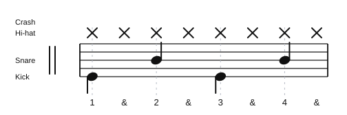

# Drum Diaries

A simple practice archive for drum exercises, grooves, and notes.

## Practice Sets

| Practice Set | Producer | Date Practiced | Difficulty |
| --- | --- | --- | --- |
| [Song Groove Practice](videos/song-groove-practice-2026-06-23.md) | Practice room whiteboard | 2026-06-23 | Medium |
| [10 Beginner Beats To Get You Playing Quickly!](videos/10-beginner-beats-rob-brown.md) | Rob Brown | 2026-06-18 | Easy |

## Exercise Templates

Use the template in `templates/exercise.md` as a starting point for each exercise page.

## Audio Playback

GitHub's repository Markdown view may not show embedded audio controls. Use each exercise's `Play in browser` link for an HTML audio player, or use the direct WAV link to download the sample.

## Notation

Exercise pages use SVG drum notation instead of text count grids. Generate notation with `tools/generate_notation_svg.py`, then embed the SVG in the exercise page.

- `C`: crash, shown with an x notehead above the hi-hat
- `HH`: hi-hat, shown with an x notehead above the staff
- `OH`: open hi-hat, shown with a circled x notehead
- `S`: snare
- `K`: kick

Example:

