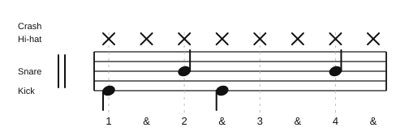

# Kick on 1 and the & of 2

Source: [10 Beginner Beats To Get You Playing Quickly! by Rob Brown](https://www.youtube.com/watch?v=nt7re7wGzqc)
Video title: 10 Beginner Beats To Get You Playing Quickly!
Video producer: Rob Brown
Date practiced: 2026-06-18
Tempo: 80 bpm
Time: 4/4

## Pattern

Shared groove:

- Hi-hat: straight eighth notes
- Snare: beats 2 and 4
- Kick: beat 1 and the & of 2

## Difficulty

Easy

## Listen

<audio controls src="../../audio/kick-variations/04-kick-on-1-and-2-and.wav">
  Your browser does not support the audio element.
</audio>

Files:

- [Play in browser](https://lkrych.github.io/drum_diaries/listen.html?audio=audio/kick-variations/04-kick-on-1-and-2-and.wav&title=Kick%20on%201%20and%20the%20%26%20of%202)
- [Download WAV](../../audio/kick-variations/04-kick-on-1-and-2-and.wav)
- [MIDI file](../../midi/kick-variations/04-kick-on-1-and-2-and.mid)
