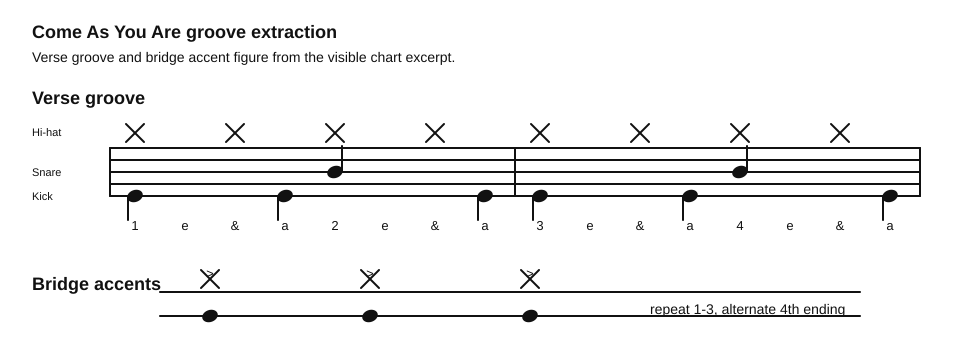

# Come As You Are Groove

Source: Drum chart screenshot
Song artist: Nirvana
Video title: Lazslo Lesson - 2026-07-03
Video producer: Lazslo
Date practiced: 2026-07-03
Duration: 1 hour lesson
Tempo: 120 bpm
Time: 4/4

## Pattern

Compact groove extraction from the visible `Come As You Are` chart.

- Hi-hat: steady eighth-note pulse
- Snare: beats 2 and 4
- Kick: syncopated verse placements
- Bridge: accented figure with repeated endings

## Transcription

- The chart shows the intro and verse at 120 bpm.
- The verse groove is represented as a two-bar practice loop.
- The bridge excerpt is summarized as the repeated accent figure rather than a full chart copy.

## Listen

First-pass audio approximation:

<audio controls src="../../audio/lazslo-lessons/come-as-you-are-groove-2026-07-03.wav">
  Your browser does not support the audio element.
</audio>

Files:

- [Play in browser](https://lkrych.github.io/drum_diaries/listen.html?audio=audio/lazslo-lessons/come-as-you-are-groove-2026-07-03.wav&title=Come%20As%20You%20Are%20Groove)
- [Download WAV](../../audio/lazslo-lessons/come-as-you-are-groove-2026-07-03.wav)
- [MIDI file](../../midi/lazslo-lessons/come-as-you-are-groove-2026-07-03.mid)

## Difficulty

TBD
