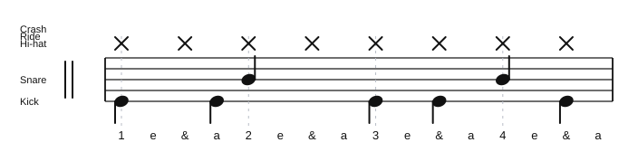

# Natalie Groove

Source: Lesson notes
Song artist: Bruno Mars
Video title: Lazslo Lesson - 2026-07-13
Video producer: Lazslo
Date practiced: 2026-07-13
Duration: 1 hour lesson
Tempo: 110 bpm
Time: 4/4

## Pattern

Practice groove reference from the lesson.

- Hi-hat: straight eighth notes
- Snare: beats 2 and 4
- Kick: pop-funk support pattern

## Transcription

- This archives the groove practiced in the lesson, not a full song chart.
- The audio is a first-pass practice approximation.

## Listen

<audio controls src="../../audio/lazslo-lessons/natalie-groove-2026-07-13.wav">
  Your browser does not support the audio element.
</audio>

Files:

- [Play in browser](https://lkrych.github.io/drum_diaries/listen.html?audio=audio/lazslo-lessons/natalie-groove-2026-07-13.wav&title=Natalie%20Groove)
- [Download WAV](../../audio/lazslo-lessons/natalie-groove-2026-07-13.wav)
- [MIDI file](../../midi/lazslo-lessons/natalie-groove-2026-07-13.mid)

## Difficulty

TBD
