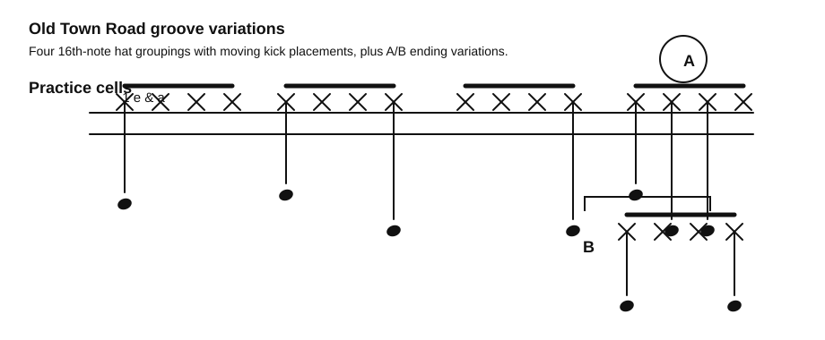

# Old Town Road Groove Variations

Source: Whiteboard photo
Song artist: Lil Nas X
Video title: Lazslo Lesson - 2026-07-06
Video producer: Lazslo
Date practiced: 2026-07-06
Duration: 1 hour lesson
Time: 4/4 groove cells

## Pattern

Old Town Road groove variations from the Monday lesson whiteboard.

## Transcription

- Practice 16th-note x-note groupings with moving low-note placements.
- The whiteboard marks an `A` variation and a `B` variation.
- Treat the notation as a groove-cell map rather than a complete chart transcription.

## Listen

First-pass audio approximation:

<audio controls src="../../audio/lazslo-lessons/old-town-road-groove-variations-2026-07-06.wav">
  Your browser does not support the audio element.
</audio>

Files:

- [Play in browser](https://lkrych.github.io/drum_diaries/listen.html?audio=audio/lazslo-lessons/old-town-road-groove-variations-2026-07-06.wav&title=Old%20Town%20Road%20Groove%20Variations)
- [Download WAV](../../audio/lazslo-lessons/old-town-road-groove-variations-2026-07-06.wav)
- [MIDI file](../../midi/lazslo-lessons/old-town-road-groove-variations-2026-07-06.mid)

## Difficulty

TBD
