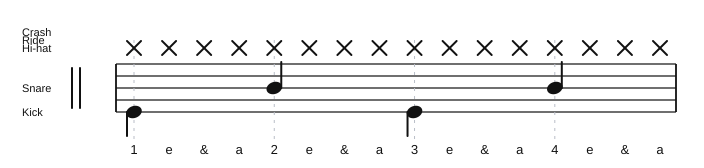

# 1 & 2 One-Handed 16th Notes

Source: Worksheet snapshot, Decoding Drumming
Song artist: Practice exercise
Video title: Lazslo Lesson - 2026-07-10
Video producer: Lazslo
Date practiced: 2026-07-10
Duration: 1 hour lesson
Tempo: 80 bpm
Time: 4/4

## Pattern

Representative one-bar practice cell from the `1 & 2 With One Handed 16th Notes - Barcelona Cathedral` worksheet.

- Hi-hat: continuous sixteenth notes
- Snare: beats 2 and 4
- Kick: beats 1 and 3

## Transcription

- The worksheet snapshot contains multiple variations; this page captures the useful core coordination cell practiced today.
- Treat this as a control exercise for keeping one-handed sixteenth notes even while the backbeat and kick stay grounded.

## Listen

<audio controls src="../../audio/lazslo-lessons/one-handed-sixteenth-notes-2026-07-10.wav">
  Your browser does not support the audio element.
</audio>

Files:

- [Play in browser](https://lkrych.github.io/drum_diaries/listen.html?audio=audio/lazslo-lessons/one-handed-sixteenth-notes-2026-07-10.wav&title=1%20%26%202%20One-Handed%2016th%20Notes)
- [Download WAV](../../audio/lazslo-lessons/one-handed-sixteenth-notes-2026-07-10.wav)
- [MIDI file](../../midi/lazslo-lessons/one-handed-sixteenth-notes-2026-07-10.mid)

## Difficulty

TBD
