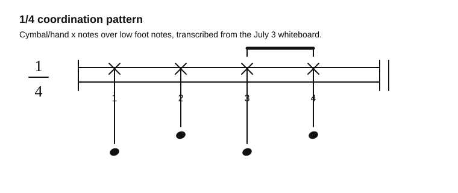

# Come As You Are Coordination

Source: Whiteboard photo
Song artist: Nirvana
Video title: Lazslo Lesson - 2026-07-03
Video producer: Lazslo
Date practiced: 2026-07-03
Duration: 1 hour lesson
Time: 1/4 coordination study

## Pattern

Likely `Come As You Are` coordination exercise: hand/cymbal x notes coordinated with lower foot notes.

## Transcription

- The whiteboard marks the pattern as `1/4`.
- Practice four evenly spaced hand/cymbal notes.
- Coordinate the lower foot notes under the hand pattern, with the second half grouped as shown.
- Song attribution is based on lesson recollection and should be corrected if the source changes.

## Listen

First-pass audio approximation:

<audio controls src="../../audio/lazslo-lessons/quarter-note-foot-hand-coordination-2026-07-03.wav">
  Your browser does not support the audio element.
</audio>

Files:

- [Play in browser](https://lkrych.github.io/drum_diaries/listen.html?audio=audio/lazslo-lessons/quarter-note-foot-hand-coordination-2026-07-03.wav&title=Come%20As%20You%20Are%20Coordination)
- [Download WAV](../../audio/lazslo-lessons/quarter-note-foot-hand-coordination-2026-07-03.wav)
- [MIDI file](../../midi/lazslo-lessons/quarter-note-foot-hand-coordination-2026-07-03.mid)

## Difficulty

TBD
