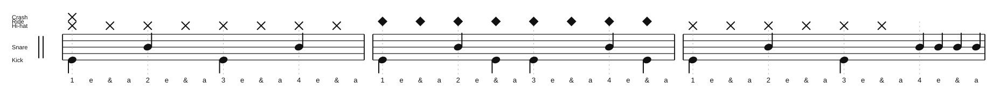

# Three-Bar Beat with Fills

Source: Lesson notes
Video title: Lazslo Lesson - 2026-07-13
Video producer: Lazslo
Date practiced: 2026-07-13
Duration: 1 hour lesson
Tempo: 95 bpm
Time: 4/4

## Pattern

Three-bar practice phrase with fills.

- Bar 1: crash on beat 1, straight eighth-note hi-hat, snare on 2 and 4
- Bar 2: ride cymbal replaces the hi-hat, snare on 2 and 4
- Bar 3: return to hi-hat and play a fill into the phrase repeat

## Transcription

- This archives the three-bar beat-and-fill idea from the lesson.
- The audio is a first-pass practice approximation.

## Listen

<audio controls src="../../audio/lazslo-lessons/three-bar-beat-with-fills-2026-07-13.wav">
  Your browser does not support the audio element.
</audio>

Files:

- [Play in browser](https://lkrych.github.io/drum_diaries/listen.html?audio=audio/lazslo-lessons/three-bar-beat-with-fills-2026-07-13.wav&title=Three-Bar%20Beat%20with%20Fills)
- [Download WAV](../../audio/lazslo-lessons/three-bar-beat-with-fills-2026-07-13.wav)
- [MIDI file](../../midi/lazslo-lessons/three-bar-beat-with-fills-2026-07-13.mid)

## Difficulty

TBD
