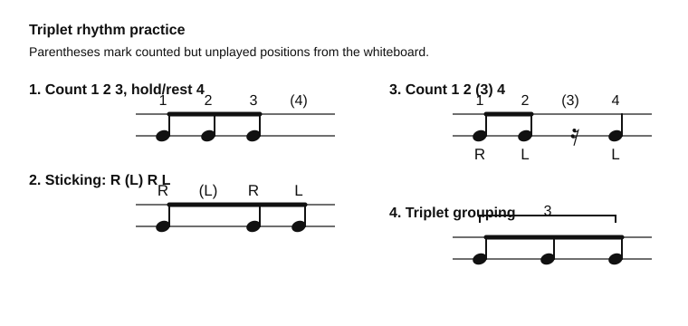

# Triplet Rhythm Practice

Source: Whiteboard photo
Video title: Lazslo Lesson - 2026-07-02
Video producer: Lazslo
Date practiced: 2026-07-02
Duration: 1 hour lesson
Time: triplet subdivision practice

## Pattern

Triplet counting and sticking variations from the whiteboard.

## Transcription

- Count `1 2 3`, with `(4)` marked as a counted but unplayed position.
- Practice sticking `R (L) R L`, with the parenthesized left treated as counted or ghosted.
- Practice `1 2 (3) 4` as `R L - L`.
- Isolate the three-note triplet grouping.

## Listen

First-pass audio approximation:

<audio controls src="../../audio/lazslo-lessons/triplet-rhythm-practice-2026-07-02.wav">
  Your browser does not support the audio element.
</audio>

Files:

- [Play in browser](https://lkrych.github.io/drum_diaries/listen.html?audio=audio/lazslo-lessons/triplet-rhythm-practice-2026-07-02.wav&title=Triplet%20Rhythm%20Practice)
- [Download WAV](../../audio/lazslo-lessons/triplet-rhythm-practice-2026-07-02.wav)
- [MIDI file](../../midi/lazslo-lessons/triplet-rhythm-practice-2026-07-02.mid)

## Difficulty

TBD
