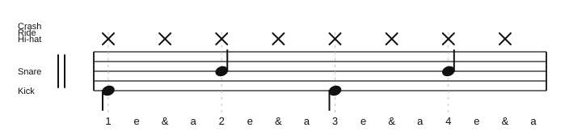

# 2 and 4 Beat Exercises

Source: Lesson notes
Video title: Lazslo Lesson - 2026-07-13
Video producer: Lazslo
Date practiced: 2026-07-13
Duration: 1 hour lesson
Tempo: 90 bpm
Time: 4/4

## Pattern

Lazslo's 2 and 4 beat exercise reference.

- Hi-hat: straight eighth notes
- Snare: beats 2 and 4
- Kick: grounded quarter-note support on beats 1 and 3

## Transcription

- This archives the coordination pattern practiced in the lesson.
- The audio is a first-pass practice approximation.

## Listen

<audio controls src="../../audio/lazslo-lessons/two-and-four-beat-exercises-2026-07-13.wav">
  Your browser does not support the audio element.
</audio>

Files:

- [Play in browser](https://lkrych.github.io/drum_diaries/listen.html?audio=audio/lazslo-lessons/two-and-four-beat-exercises-2026-07-13.wav&title=2%20and%204%20Beat%20Exercises)
- [Download WAV](../../audio/lazslo-lessons/two-and-four-beat-exercises-2026-07-13.wav)
- [MIDI file](../../midi/lazslo-lessons/two-and-four-beat-exercises-2026-07-13.mid)

## Difficulty

TBD
