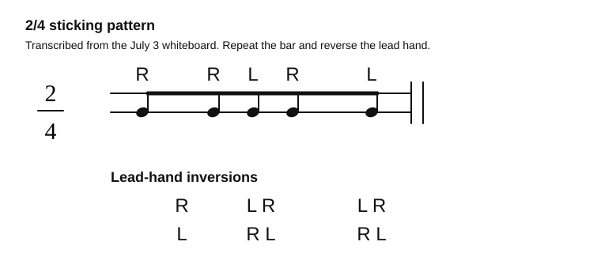

# 2/4 Sticking Grid

Source: Whiteboard photo
Video title: Lazslo Lesson - 2026-07-03
Video producer: Lazslo
Date practiced: 2026-07-03
Duration: 1 hour lesson
Time: 2/4

## Pattern

Two-four sticking exercise with lead-hand inversions.

## Transcription

- Main bar reads as a right-led phrase with the visible sticking `R R L R L`.
- The lower notes show lead-hand inversion practice: `R / L`, `L R / R L`, and `L R / R L`.
- Repeat the bar until both lead hands feel even.

## Listen

First-pass audio approximation:

<audio controls src="../../audio/lazslo-lessons/two-four-sticking-grid-2026-07-03.wav">
  Your browser does not support the audio element.
</audio>

Files:

- [Play in browser](https://lkrych.github.io/drum_diaries/listen.html?audio=audio/lazslo-lessons/two-four-sticking-grid-2026-07-03.wav&title=2%2F4%20Sticking%20Grid)
- [Download WAV](../../audio/lazslo-lessons/two-four-sticking-grid-2026-07-03.wav)
- [MIDI file](../../midi/lazslo-lessons/two-four-sticking-grid-2026-07-03.mid)

## Difficulty

TBD
