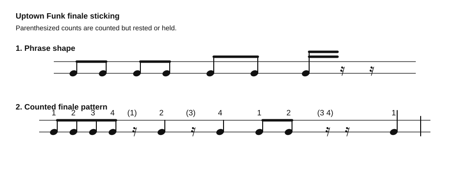

# Uptown Funk Finale Sticking

Source: Whiteboard photo
Video title: Lazslo Lesson - 2026-07-02
Video producer: Lazslo
Date practiced: 2026-07-02
Duration: 1 hour lesson
Time: counted rhythm and sticking practice

## Pattern

Finale sticking pattern for selected `Uptown Funk` ending figures.

## Transcription

- Phrase shape: short grouped notes into a held/rested ending.
- Counted phrase: `1 2 3 4 (1) 2 (3) 4 1 2 (3 4) 1`.
- Parenthesized counts are counted but rested or held.

## Listen

First-pass audio approximation:

<audio controls src="../../audio/lazslo-lessons/uptown-funk-finale-sticking-2026-07-02.wav">
  Your browser does not support the audio element.
</audio>

Files:

- [Play in browser](https://lkrych.github.io/drum_diaries/listen.html?audio=audio/lazslo-lessons/uptown-funk-finale-sticking-2026-07-02.wav&title=Uptown%20Funk%20Finale%20Sticking)
- [Download WAV](../../audio/lazslo-lessons/uptown-funk-finale-sticking-2026-07-02.wav)
- [MIDI file](../../midi/lazslo-lessons/uptown-funk-finale-sticking-2026-07-02.mid)

## Difficulty

TBD
