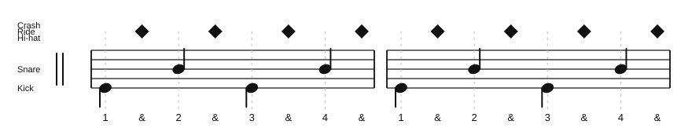

# Uptown Funk Ride Groove

Source: Lesson note from chart practice
Song artist: Mark Ronson featuring Bruno Mars
Video title: Lazslo Lesson - 2026-07-02
Video producer: Lazslo
Date practiced: 2026-07-02
Duration: 1 hour lesson
Tempo: 115 bpm
Time: 4/4

## Pattern

Near-ending "boots and cats" groove.

- Kick: beat 1, "boots"
- Ride: every `&`, "tss"
- Snare: beats 2 and 4, "cats"

## Transcription

The phrase is practiced as eighth notes: `boots tss cats tss boots tss cats tss`.

## Listen

First-pass audio approximation:

<audio controls src="../../audio/lazslo-lessons/uptown-funk-ride-groove-2026-07-02.wav">
  Your browser does not support the audio element.
</audio>

Files:

- [Play in browser](https://lkrych.github.io/drum_diaries/listen.html?audio=audio/lazslo-lessons/uptown-funk-ride-groove-2026-07-02.wav&title=Uptown%20Funk%20Ride%20Groove)
- [Download WAV](../../audio/lazslo-lessons/uptown-funk-ride-groove-2026-07-02.wav)
- [MIDI file](../../midi/lazslo-lessons/uptown-funk-ride-groove-2026-07-02.mid)

## Difficulty

TBD
