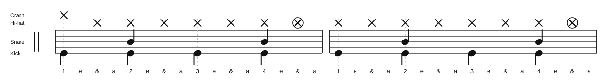

# Uptown Funk Verse Groove

Source: Drum chart screenshot
Song artist: Mark Ronson featuring Bruno Mars
Video title: Lazslo Lesson - 2026-07-02
Video producer: Lazslo
Date practiced: 2026-07-02
Duration: 1 hour lesson
Tempo: 115 bpm
Time: 4/4

## Pattern

Verse groove reference from the visible chart section.

- Hi-hat: 16th-note feel
- Crash: beat 1 entrance
- Snare: backbeat
- Kick: repeated verse placement under the backbeat

## Transcription

- The source chart labels the groove as medium pop/funk at 115 bpm.
- The visible verse section starts around the 0:17 mark.
- The chart shows repeat-style measures after the opening verse figure, so this page archives the repeated practice groove rather than the full chart page.

## Listen

First-pass audio approximation:

<audio controls src="../../audio/lazslo-lessons/uptown-funk-verse-groove-2026-07-02.wav">
  Your browser does not support the audio element.
</audio>

Files:

- [Play in browser](https://lkrych.github.io/drum_diaries/listen.html?audio=audio/lazslo-lessons/uptown-funk-verse-groove-2026-07-02.wav&title=Uptown%20Funk%20Verse%20Groove)
- [Download WAV](../../audio/lazslo-lessons/uptown-funk-verse-groove-2026-07-02.wav)
- [MIDI file](../../midi/lazslo-lessons/uptown-funk-verse-groove-2026-07-02.mid)

## Difficulty

TBD
