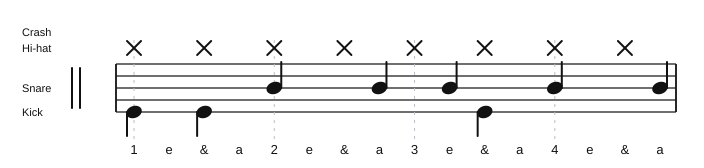
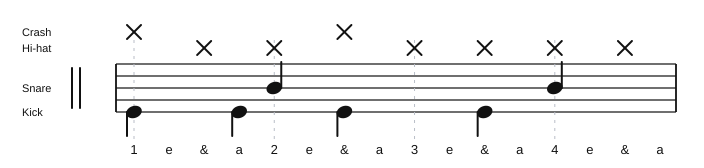

# Can't Stop

Source: Practice whiteboard photo
Song artist: Red Hot Chili Peppers
Video title: Song Groove Practice
Video producer: Practice room whiteboard
Date practiced: 2026-06-23
Tempo: 91 bpm
Time: 4/4

## Pattern

Practice groove:

- Hi-hat: straight eighth notes
- Chorus cymbals: crashes on beat 1 and the & of 2
- Snare: backbeat plus 16th-note placements
- Kick: 16th-note placements under the backbeat

Verse

Chorus

## Difficulty

Difficult

## Listen

Verse:

<audio controls src="../../audio/song-grooves/cant-stop-verse.wav">
  Your browser does not support the audio element.
</audio>

Chorus:

<audio controls src="../../audio/song-grooves/cant-stop-chorus.wav">
  Your browser does not support the audio element.
</audio>

Files:

- [Play verse in browser](https://lkrych.github.io/drum_diaries/listen.html?audio=audio/song-grooves/cant-stop-verse.wav&title=Can%27t%20Stop%20-%20Verse)
- [Verse WAV](../../audio/song-grooves/cant-stop-verse.wav)
- [Verse MIDI](../../midi/song-grooves/cant-stop-verse.mid)
- [Play chorus in browser](https://lkrych.github.io/drum_diaries/listen.html?audio=audio/song-grooves/cant-stop-chorus.wav&title=Can%27t%20Stop%20-%20Chorus)
- [Chorus WAV](../../audio/song-grooves/cant-stop-chorus.wav)
- [Chorus MIDI](../../midi/song-grooves/cant-stop-chorus.mid)
