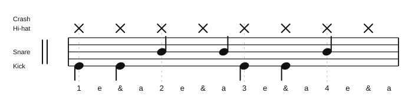

# The Hours

Source: Practice whiteboard photo
Song artist: Beach House
Video title: Song Groove Practice
Video producer: Practice room whiteboard
Date practiced: 2026-06-23
Tempo: 120 bpm
Time: 4/4

## Pattern

Practice groove:

- Hi-hat: straight eighth notes
- Snare: beat 2, the a of 2, and beat 4
- Kick: beat 1, the & of 1, beat 3, and the & of 3

## Difficulty

Medium

## Listen

<audio controls src="../../audio/song-grooves/the-hours.wav">
  Your browser does not support the audio element.
</audio>

Files:

- [Play in browser](https://lkrych.github.io/drum_diaries/listen.html?audio=audio/song-grooves/the-hours.wav&title=The%20Hours)
- [Download WAV](../../audio/song-grooves/the-hours.wav)
- [MIDI file](../../midi/song-grooves/the-hours.mid)
